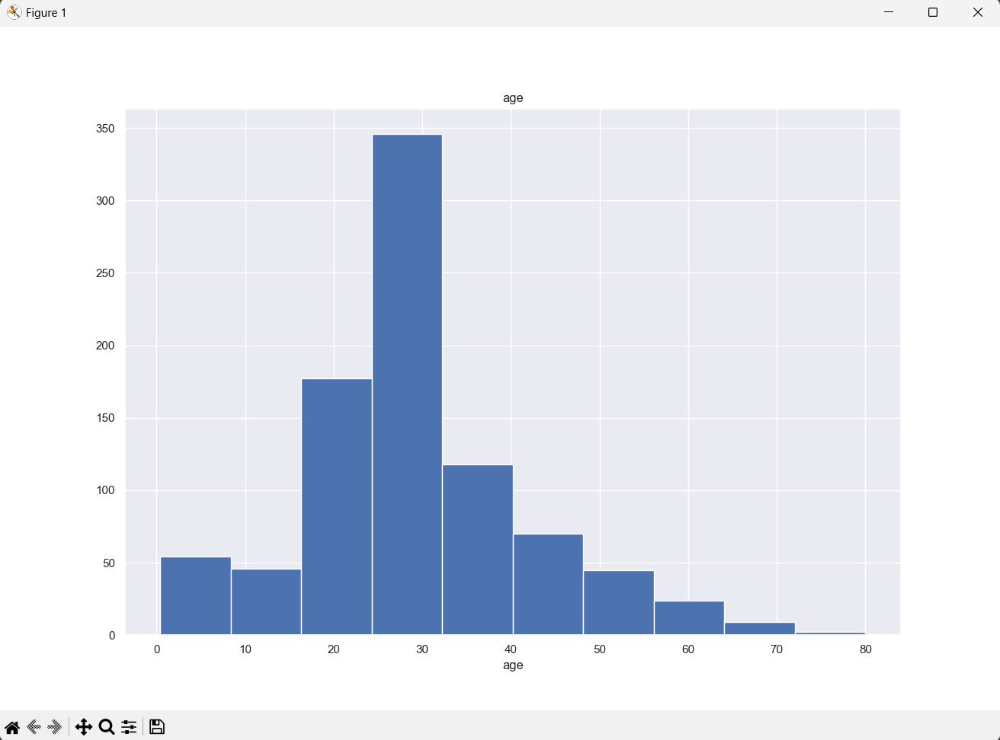

<h1>Titanic Veri Analizi</h1>
Bu proje, Titanic veri seti üzerinde bir dizi veri analizi ve görselleştirme gerçekleştirir.



<h3>Projede aşağıdaki analizler ve işlemler gerçekleştirilimiştir:</h3>

<ul>
    <ol>
        <b>Veri ön işleme:</b><li>Eksik değerlerin medyan ile doldurulması</li>
                       <li>Değişkenlerin uygun tiplere dönüştürülmesi</li>
    </ol>
    <ol> <b>Kategorik Değişken Analizi: </b><li>Değişkenlerin kategorik olup olmadığının belirlenmesi</li>
                                    <li>Kategorik değişkenlerin analizi</li></ol>
    <ol><b>Sayısal Değişken Analizi:</b><li>Değişkenlerin sayısal olup olmadığının belirlenmesi</li>
                                        <li>Sayısal değişkenlerin analizi</li></ol>
    <ol><b>Korelasyon Analizi:</b><li>Değişkenler arasındaki ilişkilerin analizi</li>
                                    <li>Yüksek korelasyonlu değişkenlerin belirlenmesi</li></ol>
    <ol><b>Görselleştirme:</b><li>Cinsiyetin hayatta kalma durumu üzerindeki etkisini gösteren bar grafiği</li>
                              <li>Yaş dağılımını gösteren  histogram</li>
                               <li>Hayatta kalma ve diğer özellikler arasındaki korelasyonları gösteren ısı haritası oluşturuldu</li></ol>
</ul>
<h2>Kullanılan Teknolojiler ve Kütüphaneler</h2>

<h3>Projede aşağıdaki Python kütüphaneleri kullanılmıştır:</h3>
<ul><li>
Numpy:Bilimsel Hesaplamalar için kullanıldı.</li>
<li>Pandas:Veri Manipülasyonu ve analiz için kullanıldı.</li>
<li>Seaborn: Veri görselleştirme için kullanıldı.</li>
<li>Matplotlib: Daha fazla veri görselleştirme için kullanıldı</li>
</ul>
<h2>Projede Oluşturulan Grafikler</h2>
<h3>Cinsiyete göre yolcu sayısı dağılımı grafiği:</h3>

<h3>Yolcuların Yaş Dağılımı</h3>

<h3>Numeral Değişkenlerin Korelasyon Matrisi</h3>

<h3>Yüksek Korelasyonlu Değişkenlerin Filtrasyonu Sonrası Korelasyon Matrisi:</h3>

<h3>Cinsiyete Göre Hayatta Kalma Durumu:</h3>

<h3>Özelliklere Göre Hayatta Kalma DUrumu:</h3>

<h3>Bir sonraki projelerde görüşmek üzere!</h3>

